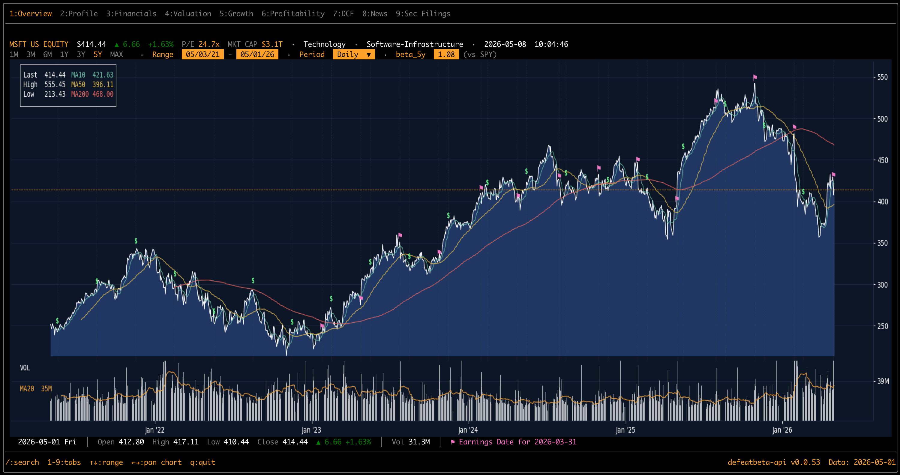
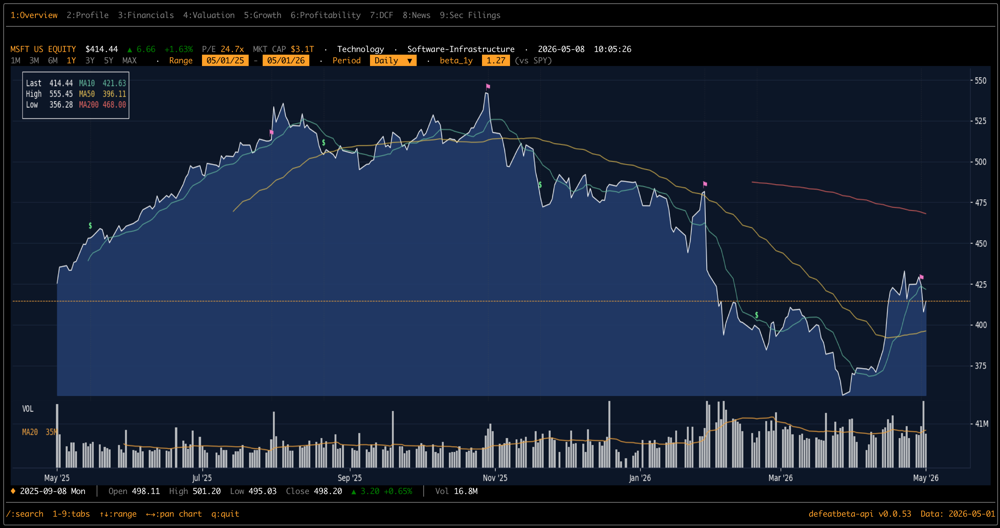
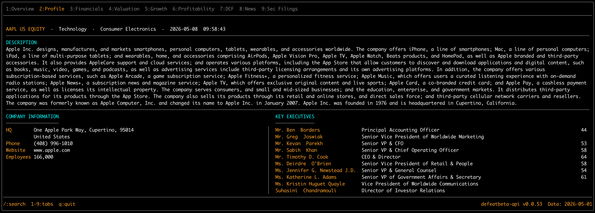
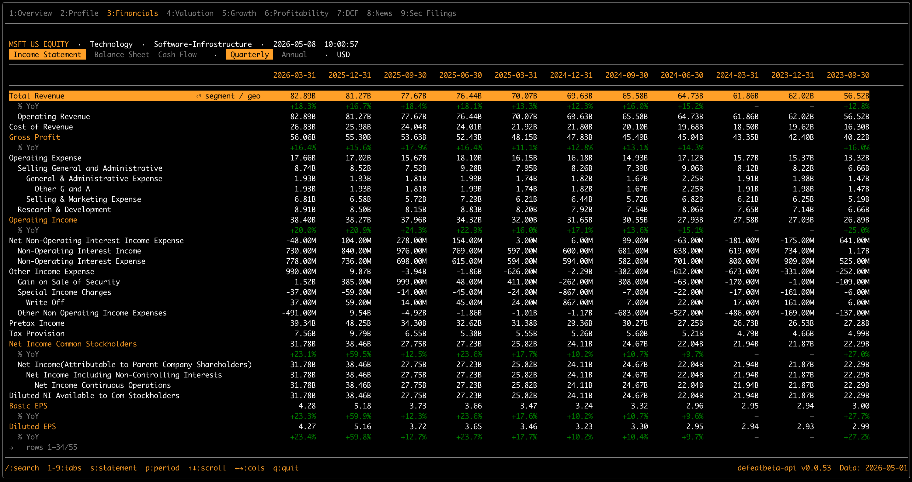
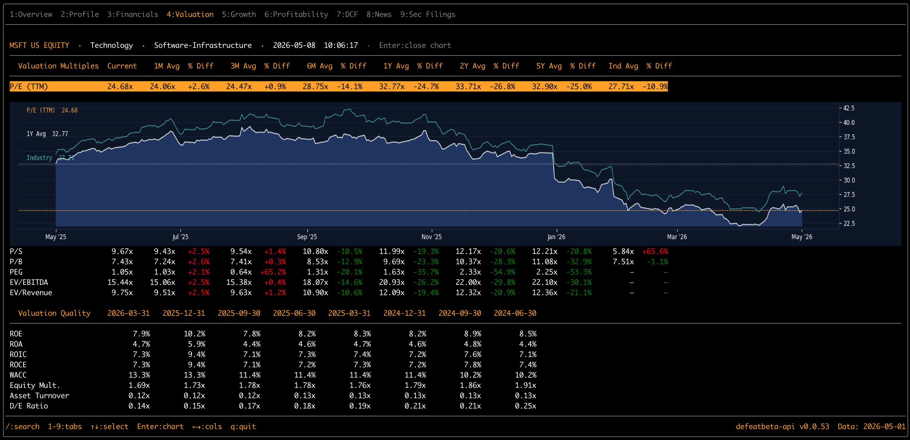
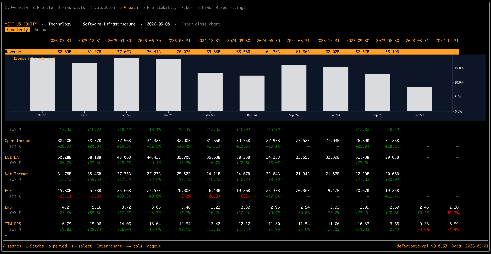
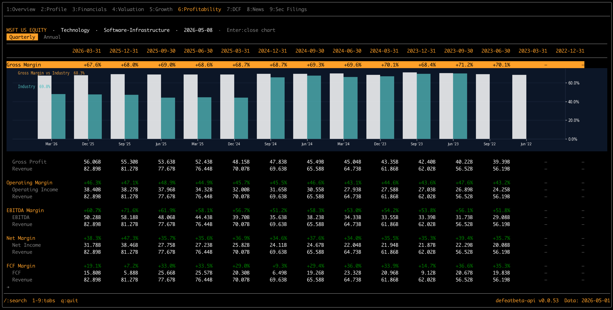
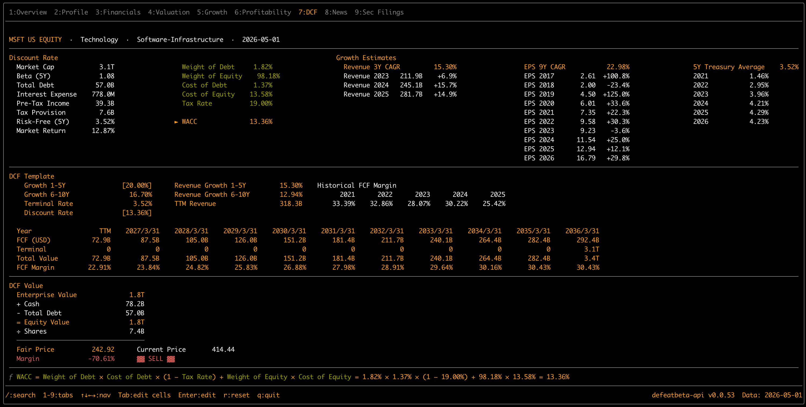
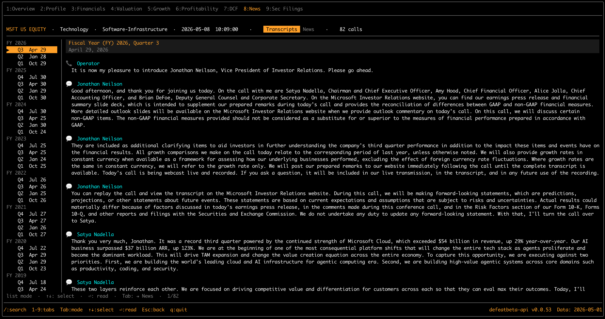
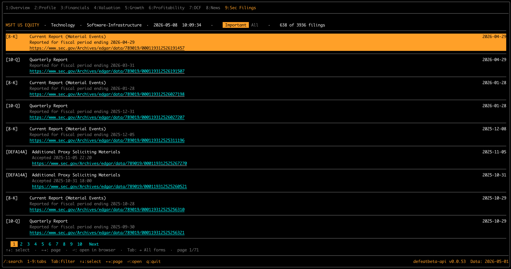

# defeatbeta-terminal

[](https://github.com/defeat-beta/defeatbeta-terminal/actions/workflows/ci.yml)
[](./LICENSE)

A **Bloomberg-style terminal in your terminal** — a TUI client for stock
analysis, powered by [`defeatbeta-api`][api].

> **Status:** v0.0.x, actively developed. macOS-tested; Linux should work, Windows
> via WSL only.

[api]: https://github.com/defeat-beta/defeatbeta-api
[opentui]: https://github.com/sst/opentui
[solid]: https://www.solidjs.com/

---

## Screenshot

<!-- TODO: replace with a hero screenshot. Recommended: Overview tab on AAPL with the price chart visible. -->



---

## What's inside

Nine tabs, each Bloomberg-coded:

| # | Tab | What it shows | Highlights |
|---|---|---|---|
| 1 | **Overview** | Price line + volume panel, MA10/50/200, earnings ▼ / dividends $ / split ⇅ markers | Rendered by matplotlib → piped into the terminal as an iTerm2 inline image; ↑↓ adjusts range, ←→ pans |
| 2 | **Profile** | Company description, address, key executives | Bloomberg DES-style |
| 3 | **Financials** | Income Statement / Balance Sheet / Cash Flow with hierarchy + YoY | `s` switches statement, `p` flips quarterly/annual, Enter on **Total Revenue** expands a segment / geography breakdown panel |
| 4 | **Valuation** | P/E (TTM), P/S, P/B, PEG, EV/EBITDA, EV/Revenue + industry overlays | Click into a row → inline chart (multiples vs industry) |
| 5 | **Growth** | YoY growth for Revenue / OpInc / EBITDA / Net Income / FCF / EPS | Quarterly/Annual toggle, click a row → chart |
| 6 | **Profitability** | Gross / Operating / EBITDA / Net / FCF margins, with industry comparison | Bar chart per metric |
| 7 | **DCF** | Editable 3-stage DCF (growth, discount rate, terminal) | Tab cycles between editable cells, Enter to edit, formula bar at the bottom |
| 8 | **News** | Earnings-call transcripts (lazy-loaded paragraphs) + financial news cards (paginated, lazy-loaded summaries) | Tab toggles sub-mode; ⏎ enters reading mode; URLs are clickable in supporting terminals |
| 9 | **SEC Filings** | EDGAR submissions card list, filtered by importance | Tab toggles **Important** (10-K/10-Q/8-K/DEF 14A/etc.) ↔ **All forms**; ⏎ opens EDGAR in browser |

Global keys: `1`-`9` switch tabs, `/` or `:` triggers ticker search, `q` quits.

<!-- TODO: per-tab screenshots — list of placeholders below; replace with real images. -->

<details>
<summary>Per-tab screenshots</summary>

**1. Overview**



**2. Profile**



**3. Financials**



**4. Valuation**



**5. Growth**



**6. Profitability**



**7. DCF**



**8. News**



**9. SEC Filings**



</details>

---

## Quick start

### Prerequisites

- **[uv][uv]** (Python package manager)
- **Python** 3.11+
- **Terminal that supports iTerm2 inline images** for the price chart on the
  Overview tab (iTerm2, WezTerm, kitty all work). Other tabs work in any
  terminal.
- Optional: an HTTP proxy if `huggingface.co` (the data host) isn't directly
  reachable from your network.

[bun]: https://bun.sh/
[uv]: https://github.com/astral-sh/uv

### Install uv

macOS/Linux:

```bash
curl -LsSf https://astral.sh/uv/install.sh | sh
```

Or with Homebrew:

```bash
brew install uv
```

### Install defeatbeta-terminal

```bash
curl -fsSL https://raw.githubusercontent.com/defeat-beta/defeatbeta-terminal/main/install.sh | bash
```

Start the terminal:

```bash
defeatbeta
```

Then press `/` to search a ticker (for example `AAPL`, `NVDA`, or `TSLA`),
`1`-`9` to switch tabs, and `q` to quit.

If your network needs a proxy to reach Hugging Face, start it with
`HTTP_PROXY`:

```bash
HTTP_PROXY="http://127.0.0.1:8118" defeatbeta
```

### Update defeatbeta-terminal

Run the installer again:

```bash
curl -fsSL https://raw.githubusercontent.com/defeat-beta/defeatbeta-terminal/main/install.sh | bash
```

Development setup is documented in [CONTRIBUTING.md](./CONTRIBUTING.md).

---

## Contributing

Contributions welcome — issues, PRs, and ideas. See [CONTRIBUTING.md](./CONTRIBUTING.md)
(coming soon) for the workflow. Quick pointers in the meantime:

- The fastest way to find work is the [`good first issue`][gfi] label.
- Each tab is a self-contained component; pick one and improve it.
- Bug reports: please include your terminal, OS, ticker, and a screenshot.

[gfi]: https://github.com/defeat-beta/defeatbeta-terminal/labels/good%20first%20issue

---

## Credits

- Data: [`defeatbeta-api`][api] — column-pruned, lazy-loaded reads of the
  Yahoo Finance + SEC EDGAR mirror hosted on Hugging Face Datasets.
- Rendering: [OpenTUI][opentui] — the modern TUI framework that makes box-/flex-style
  layout actually pleasant in a terminal.
- Reactivity: [Solid.js][solid] — fine-grained reactivity, React-flavored DSL.
- Inspiration: Bloomberg Terminal's keyboard-first information density.

---

## License

Apache License 2.0 — see [LICENSE](./LICENSE).
